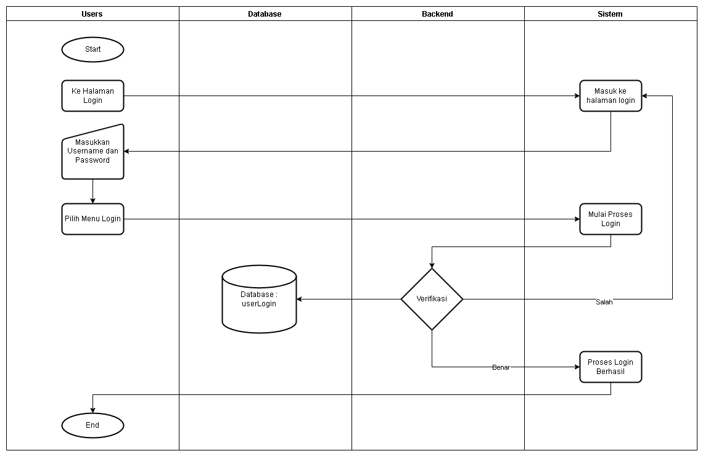

# Jurnal Aplikasi Proyek 3

Quick View :

[Abstrak](#abstrak)

[Pendahuluan](#pendahuluan)

[Metodologi Penelitian](#metodologi-penelitian)

[Arsitektur Aplikasi](#arsitektur-aplikasi)

# Abstrak
Aplikasi pendidikan otomotif berbasis website merupakan proyek inovatif yang bertujuan untuk mengefektifkan pendidikan otomotif di era digital saat ini. Mengingat tantangan yang dihadapi siswa, seperti kurangnya akses terhadap materi pelajaran terkini dan kurangnya pengalaman praktis, aplikasi ini dirancang untuk mengatasi kendala tersebut. Berkat pendekatan gabungan teknologi Internet dan multimedia, aplikasi ini menyediakan platform pembelajaran yang kaya dan interaktif. Dengan cara ini, pengguna dapat dengan mudah mengakses materi pelatihan otomotif terkini dan relevan. Aplikasi ini tidak hanya memberikan pemahaman teoritis tentang konsep otomotif tetapi juga menawarkan simulasi realistis dan tes latihan yang memungkinkan  pengguna  mengasah keterampilan virtualnya.

Salah satu aspek kunci dari aplikasi ini adalah kemampuannya untuk menciptakan komunitas pembelajar yang dinamis. Dengan menyediakan forum diskusi dan fitur kolaboratif lainnya, aplikasi ini memfasilitasi pertukaran ide dan pengalaman antara para pengguna. Hal ini tidak hanya meningkatkan pemahaman mereka, tetapi juga membangun jaringan profesional yang berharga di dunia otomotif. Dengan menyatukan aspek edukatif dan sosial, Aplikasi Pendidikan Otomotif Berbasis Website bukan hanya sekadar alat pembelajaran, tetapi juga menjadi wadah bagi pengguna untuk mengembangkan diri mereka secara holistik. Dengan demikian, aplikasi ini tidak hanya membantu mengisi kesenjangan antara kebutuhan industri otomotif yang terus berkembang dan keterampilan yang dimiliki oleh para profesional di lapangan, tetapi juga merangsang minat dan semangat dalam bidang otomotif di kalangan para pembelajar.

Kata Kunci : Aplikasi, Pendidikan, Otomotif.

# Abstact

The web-based automotive education app is an innovative project that aims to streamline automotive education in today's digital age. Given the challenges students face, such as lack of access to up-to-date subject matter and lack of practical experience, this app is designed to overcome these obstacles. Thanks to its combined approach of Internet and multimedia technologies, the app provides a rich and interactive learning platform. In this way, users can easily access current and relevant automotive training materials. The app not only provides a theoretical understanding of automotive concepts but also offers realistic simulations and practice tests that allow users to hone their virtual skills.

One of the key aspects of this app is its ability to create a vibrant community of learners. By providing discussion forums and other collaborative features, the app facilitates the exchange of ideas and experiences between users. This not only enhances their understanding, but also builds a valuable network of professionals in the automotive world. By bringing together the educational and social aspects, the Web-based Automotive Education App is not just a learning tool, but also a platform for users to develop themselves holistically. As such, it not only helps fill the gap between the ever-growing needs of the automotive industry and the skills possessed by professionals in the field, but also stimulates interest and passion in the automotive field among learners.

Keywords: Aplication, Education, Automotive.

# Pendahuluan

Di era modern sekarang, segala aspek kehidupan tidak terlepas dengan teknologi. Baik dalam industri, maupun dalam kehidupan sehari-hari. Teknologi menjadi hal yang dibutuhkan bagi masyarakat yang berkehidupan modern, terlebih dalam informasi. Teknologi Informasi sudah menjadi kebutuhan sehari-hari bagi masyarakat, terdapat berbagai teknologi informasi yang hingga saat ini telah menjadi bagian penting dalam kehidupan sehari-hari tersebut.

Terdapat berbagai teknologi informasi yang ada di era modern ini, berbagai media sosial telah mengimplementasikan teknologi ini. Namun, ketersediaan media yang disediakan dirasa sangat sedikit, terlebih dalam dunia otomotif yang masih terdengar awam bagi masyarakat.

Dalam teknologi informasi dalam dunia otomotif, ada berbagai perilaku masyarakat yang berbeda dalam memandang dunia otomotif ini. Ada yang menggunakannya sebagai media informasi berbagi ilmu dalam otomotif, adapun mereka yang menggemari dunia otomotif ini hingga berbagi pengalaman mereka dalam hal tersebut, dan adapun mereka yang hanya mencari tahu bagaimana mereka dapat mencari jalan keluar dalam permasalahan kendaraan mereka melalui teknologi informasi teknologi tersebut.

Oleh karenanya, adanya aplikasi Pendidikan Otomotif Sebagai Bagian dari teknologi informasi diharapkan menjadi pemudah dalam hubungan masyarakat yang menggemari dunia otomotif, sekaligus mereka yang ingin menemukan jalan keluar dalam dunia otomotif tersebut.

Dalam Jurnal ini, kami pun ingin mencari tahu bagaimana perilaku masyarakat dalam menggunakan aplikasi web yang kami buat ini. Dan dengan adanya jurnal ini, kami dapat lebih tahu bagaimana pandangan masyarakat dalam dunia otomotif ini menggunakan media teknologi informasi sebagai jalan keluar bagi mereka.

# Metodologi Penelitian

Pada Umumnya, Metologi dilakukan menggunakan metode waterfall, yang amat sangat mudah dipahami dan sudah banyak developer yang menggunakan metode tersebut, Berikut adalah gambaran pada metode tersebut.

Gambar berikut menunjukkan gambaran umum pada metode waterfall. Didalamnya terdapat 5 tahap, yaitu Requirement, Analysis, Implement, Testing, dan Maintenance. Setiap tahap berperan dalam pengelolaan data analisis.
adapun dalam kegiatan pembuatan jurnal, terdapat tahap yang dilakukan pada metodologi penelitian ini.

Berikut penjelasan tentang Requirement, Analysis, Implement, Testing dan Maintenance :
1. Requirement (Kebutuhan) : Tahap ini adalah awal dari pengembangan perangkat lunak. Di sini, tim mengumpulkan informasi dari berbagai pihak terkait untuk memahami kebutuhan dasar pengguna, bisnis, dan teknis yang diperlukan. Fokusnya adalah memahami apa yang seharusnya dicapai oleh perangkat lunak yang akan dibuat.
2. Analysis (Analisis) : Setelah kebutuhan terkumpul, tim melakukan analisis lebih mendalam. Mereka menyusun dan merancang struktur serta fungsi perangkat lunak berdasarkan informasi yang diperoleh sebelumnya. Analisis ini mencakup cara sistem akan beroperasi, bagaimana komponen akan berinteraksi, serta rincian teknis dan fungsionalitas yang diperlukan.
3. Implement (Implementasi) : Tahap ini melibatkan proses penerjemahan desain yang telah dibuat ke dalam kode-kode pemrograman yang sesungguhnya. Tim pengembang menggunakan bahasa pemrograman dan alat yang sesuai untuk mewujudkan konsep dan rancangan yang telah dibuat sebelumnya.
4. Testing (Pengujian) : Setelah implementasi, perangkat lunak diuji secara menyeluruh. Ini mencakup pengujian fungsionalitas, keamanan, kinerja, dan kompatibilitas untuk memastikan bahwa perangkat lunak dapat beroperasi sesuai dengan yang diharapkan dan memenuhi standar kualitas yang ditetapkan.
5. Maintenance (Pemeliharaan): Setelah perangkat lunak diluncurkan, pemeliharaan menjadi penting. Ini melibatkan pembaruan rutin, perbaikan bug, peningkatan fitur, dan dukungan teknis agar perangkat lunak tetap berjalan dengan baik seiring waktu.

## 1. Tahap Pencarian Data (Crawling Data)

Kegiatan Crawling Data dilakukan untuk mendapatkan data melalui kegiatan nyata, sehingga didapatkan hasil pada eksplorasi data tersebut.

Langkah - Langkah crawling data :

1. Definisikan Tujuan Penelitian:
Tentukan dengan jelas tujuan dari pengumpulan data melalui crawling.

2. Identifikasi Sumber Data
Pilih sumber-sumber data yang relevan dengan tujuan penelitian Anda. Sumber data dapat berupa website, forum, media sosial, atau platform online lainnya.

3. Pilih dan Persiapkan Alat Crawling
Pilih alat atau perangkat lunak crawling yang sesuai dengan kebutuhan Anda. Beberapa contoh alat termasuk Scrapy, BeautifulSoup, atau Selenium. Persiapkan alat ini dan sesuaikan dengan struktur dan tata letak sumber data.

4. Lakukan Analisis Legal dan Etika
Pastikan bahwa pengambilan data melalui crawling tidak melanggar hak cipta atau kebijakan privasi dari sumber data yang Anda tuju. Pertimbangkan etika dalam penggunaan data dan pastikan untuk memahami dan mematuhi aturan yang berlaku.

5. Identifikasi Pola URL atau Struktur Data
Pahami pola URL atau struktur data pada sumber yang akan Anda crawl. Ini membantu dalam membuat logika crawling yang efisien dan memastikan bahwa Anda mengambil data yang relevan.

6. Konfigurasi Parameter Crawling:
Atur parameter crawling, seperti batasan kecepatan crawling, kedalaman pengambilan data, dan jenis data yang ingin diambil. Hal ini membantu dalam menghindari overloading server dan memastikan efisiensi dalam pengumpulan data.

7. Uji Coba Crawling
Sebelum melakukan crawling penuh, uji coba alat atau skrip Anda pada sejumlah kecil data atau halaman. Pastikan bahwa pengambilan data berjalan dengan baik dan sesuai dengan yang diinginkan.

8. Lakukan Crawling Penuh
Setelah uji coba sukses, lakukan crawling penuh sesuai dengan parameter yang telah diatur. Pastikan untuk memonitor proses ini secara teratur untuk menanggapi potensi masalah.

9. Proses Data yang Telah Dicrawl
Setelah data terkumpul, proses data sesuai dengan kebutuhan penelitian Anda. Ini mungkin melibatkan pembersihan data, penggabungan, atau transformasi data untuk analisis lebih lanjut.

10. Interpretasi dan Analisis Data
Setelah data telah diolah, interpretasikan dan analisis hasilnya sesuai dengan tujuan penelitian Anda. Identifikasi temuan kunci dan kaitannya dengan pertanyaan penelitian.

11. Dokumentasikan Metode dan Hasil
Pastikan untuk mendokumentasikan metode pengumpulan data secara rinci dan transparan. Ini akan membantu dalam mendukung validitas dan reproduktivitas penelitian.

## 2. Sampling Data

Sampling Data dilakukan untuk menyaring data sehingga didapatkan sampel data yang sedikit namun bersifat objektif, sehingga dapat menghemat waktu dan memudahkan dalam pengumpulan hasil data.

## 3. Pengumpulan Data

Pengumpulan data dilakukan untuk menyatukan semua data kedalam satu hasil, sehingga dapat memudahkan dalam memvisualisasi data.

# Arsitektur Aplikasi

Arsitektur pada aplikasi ini terdiri dari perhubungan antar komponen pengguna dengan aplikasi web yang memiliki akses dengan internet, dimana akses ini memungkinkan pengguna untuk mendapatkan informasi yang dibutuhkan dari Database terkait data pada aplikasi yang berjalan.

Berikut adalah gambaran dari proses aplikasi yang berjalan berikut :

Adapun Arsitektur Proses pada aplikasi yang telah di gambarkan kedalam flowmap berikut :

## Arsitektur Proses Login

Pada Arsitektur Flowmap berikut, ditampilkan alur pada proses login.

## Arsitektur Proses Sign Up

Pada Arsitektur Flowmap berikut, ditampilkan alur pada proses SignUp.

# Arsitektur Dashboard

Pada bagian berikut adalah berbagai Flowmap Arsitektur yang digunakan dalam Operasional Dashboard.

## Proses Input Data Artikel

Pada Arsitektur Flowmap berikut, ditampilkan alur pada proses menambahkan Artikel Baru. Proses Input Data Artikel berlaku untuk pengelolaan satu User.

## Proses Hapus Artikel

Arsitektur Flowmap berikut adalah alur pada proses penghapusan artikel. Penghapusan Artikel berlaku untuk pengelolaan satu User.

